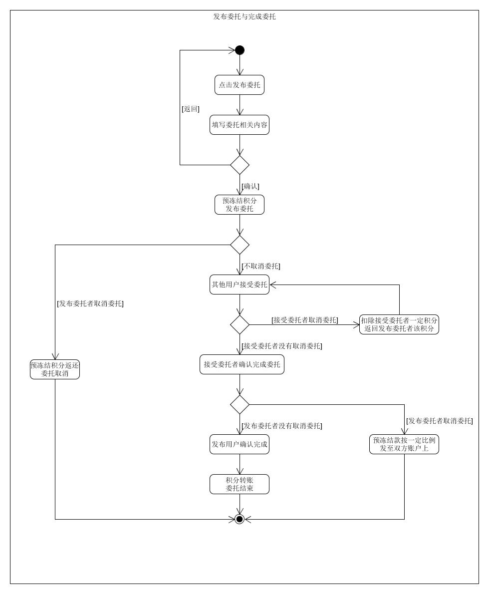
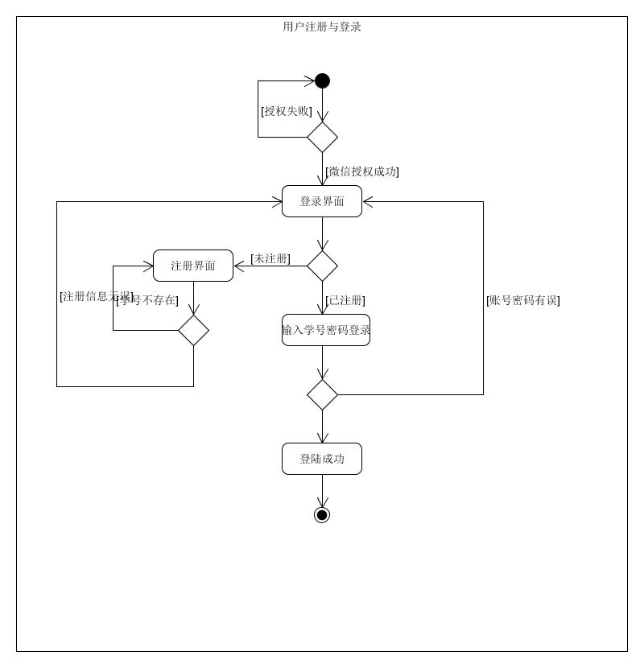
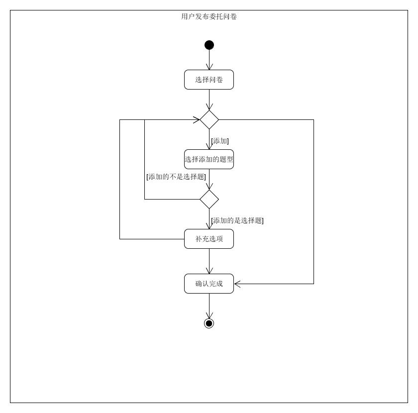

# Use cases

## 详述用例

###  Use case1 发布委托与完成委托

**范围**：挣闲钱应用

**级别**：用户级别

**主要参与者**：发布委托的用户、接受委托的用户

**涉众及关注点**：

- 发布委托的用户：希望能够便捷、清晰表达自己的委托诉求。希望能够按照自己的意愿，定制化委托的截止时间等。希望能够在中途对已经发布的委托进行取消。希望能够在确定委托被完成之后才进行积分的扣除和转账。
- 接受委托的用户：希望能够便捷、清晰看到当前可以接受的所有委托。希望能够查看委托的详情内容。希望能够准确无误接受可完成的委托。希望能够接受委托之后可以选择放弃已接受的委托。
- 运营平台：希望进行及时、准确的积分转账。希望能够得到用户的相关授权。

**前置条件**：顾客必须进行微信授权。顾客必须已经注册登录账号。

**成功保证（后置条件）**：正确存储委托信息。正确存储委托与不同用户之间的关系。正确进行委托积分的计算和转账。

**主成功场景（或基本流程）**：

1. 发布委托的用户通过点击发布委托进行发布界面
2. 发布委托的用户通过设置委托的类型、委托的地点、委托的描述、委托的截止时间、委托的报酬来完善委托的内容
3. 发布委托的用户确认委托无误后可发布委托，委托积分进行预冻结
4. 接受委托者可以在委托列表查看可接受委托
5. 接受委托者可以查看该委托的具体详情
6. 接受委托者可以接受委托
7. 接受委托者完成委托后，可点击确认完成
8. 发布委托者在确认委托完成后点击确认完成，结束该笔委托的交易
9. 冻结积分解冻并转账至接受委托者的账户上

**扩展（或替代流程）**：

- 2a. 发布委托的用户在发布过程中意外或非意外退出发布界面

  ​	i. 系统不对之前填写一半的记录进行保存

  ​	ii. 用户重新进入发布委托系统后，所有的委托内容需要重新输入

- 3a. 发布委托的用户确认委托时积分不足

  ​	i. 提示用户账户积分不足，发布委托失败

- 6a. 接受委托的用户积分不足

  ​	i. 提示用户账户积分不足，无法接受委托

- 6b. 被接受的委托已经截止

  ​	i. 提示用户该委托已经过了截止时间，接受委托失败

- 7a. 截止时间未完成委托

  ​	i. 该订单自动取消

  ​	ii. 接受委托者扣除一定量的积分作为惩罚

  ​	iii. 委托预冻结的积分返回发布委托的用户，并给予接受委托者扣除的费用作为补偿

- 8a. 发布委托者未确认订单

  ​	i. 在截止时间之后自动完成该订单并进行积分转账

- *a. 发布委托者在委托被接受前取消订单

  ​	i. 委托取消

  ​	ii. 委托预冻结的积分返回发布委托者的账户

- *b. 发布委托者在委托被接受后取消订单

  ​	i. 委托取消

  ​	ii. 返回部分委托预冻结积分到发布委托者账户上

  ​	iii. 返回部分委托预冻结积分到接受委托者账户上作为补偿

- *c. 接受委托者取消订单

  ​	i. 接受委托者与委托的关系取消

  ​	ii. 接受委托者扣除一定的积分

  ​	iii. 发布委托者获得接受委托者账户扣除的积分作为补偿

**特殊需求**：

- 无

**发生频率**：不间断随时发生

**未解决问题**：

- 订单未完成时，对于交易双方的责任追究
- 发布委托者可在已经发布但是未被接受的委托上进行修改

**活动图**

## 非正式用例

### Use case 2.1 用户注册登录

**主成功场景**：用户经过微信授权后进入小程序，输入学号以及密码进行注册，注册完后输入学号和密码进行登录操作。

**交替场景**：

- 顾客如果之前已经注册过账号的，可以直接登录
- 顾客注册账号时，发现学号已被注册，可以联系后台管理员进行认证或自行找回密码

**活动图**

### Use case 2.2 用户发布委托问卷

**主成功场景**：用户选择发布问卷的委托类型，进入题目设置的窗口。通过添加不同的题型（选择题、判断题、问答题）来完成委托问卷的内容，确认无误后即可进行发布。

**交替场景**：

- 当添加题目为选择题时，需要完成ABCD四个选项的内容。

**活动图**：

## 简述用例

### Use case 3 查看委托广场

- Actor：用户
- Desscription：顾客进入小程序，可以切换到委托广场，浏览当前已经发布的委托。对于感兴趣的委托可以点击查看详情。