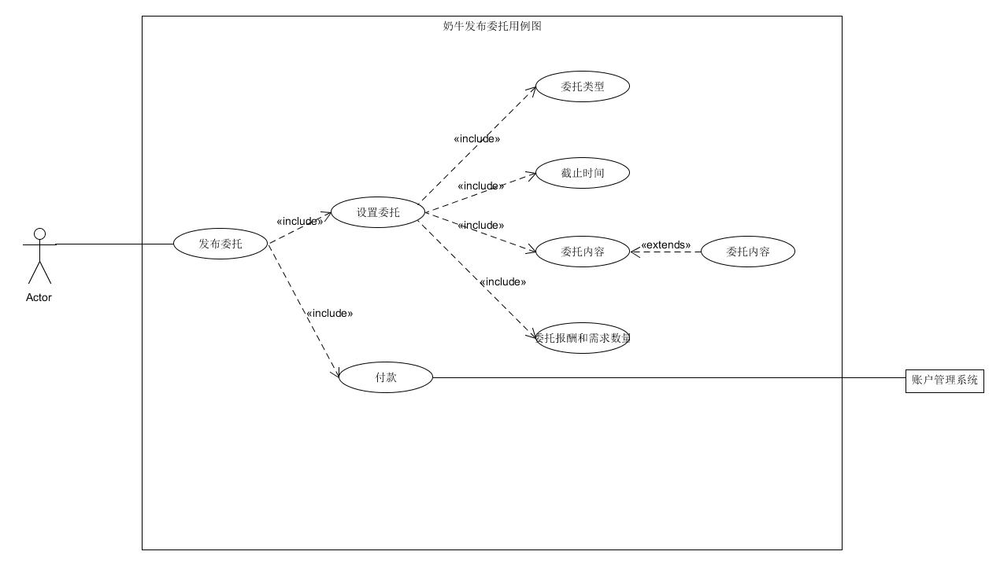
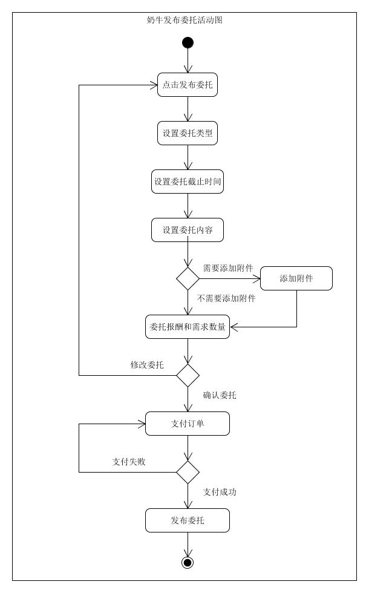
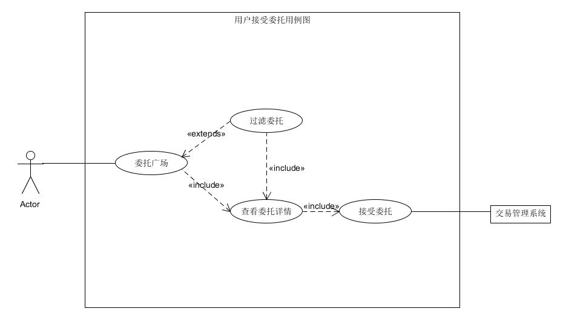
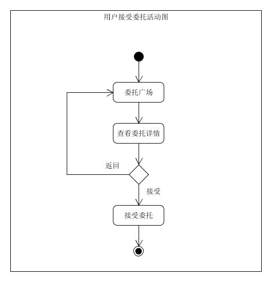
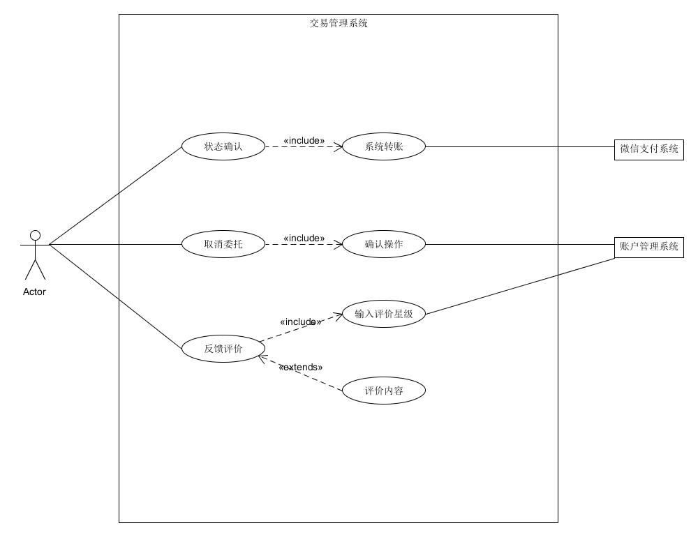
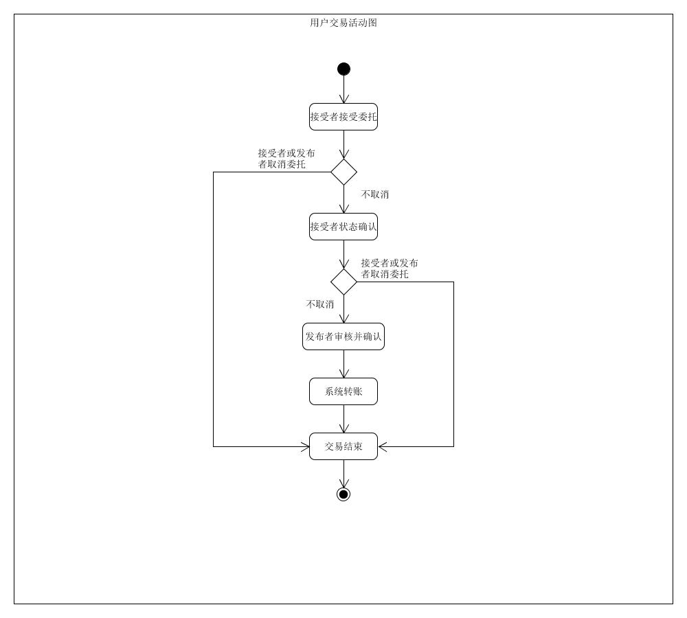

# Use cases

## 1. 简述用例

### 1.1 发布者发布委托

**主要参与者**：发布委托的用户

**涉众关注点**：

- 可以自由选择线上或线下委托
- 可以自由设置委托的DDL以及报酬
- 可以对委托参与者进行信誉分的筛选

**用例图**

**活动图**

### 1.2 用户接受委托

**主要参与者**：接受委托的用户

**涉众关注点**：

- 可以查看委托详情之后再决定是否接受委托

**用例图**：

**活动图**：

### 1.3 双方达成交易

**主要参与者**：所有用户

**涉众关注点**：

- 在交易过程中，双方都有权利对委托进行取消
- 对于无故取消委托者需要进行一定的惩罚
- 双方在交易过程中都可以进行状态的确认，双方确认之后方可达成交易

**用例图**：

**活动图**：

## 2. 简述用例

### 2.1 用户注册登录

**主要参与者**：所有用户

**涉众关注点**：

- 用户注册登录的时候可以一键获取到微信的昵称和头像，即获取微信授权，无需进行再一次的注册或登录
- 用户注册时，需要进行校园用户身份的认证

### 2.2 用户取消委托

**主要参与者**：所有用户

**涉众关注点**：

- 接受委托者在进行状态确认之前，有权利进行委托的取消
- 发布委托者在进行状态确认之前，有权利进行委托的取消
- 系统需要针对无故取消委托的一方进行信誉分的惩罚，惩罚的多少根据委托取消的时间点进行判断

