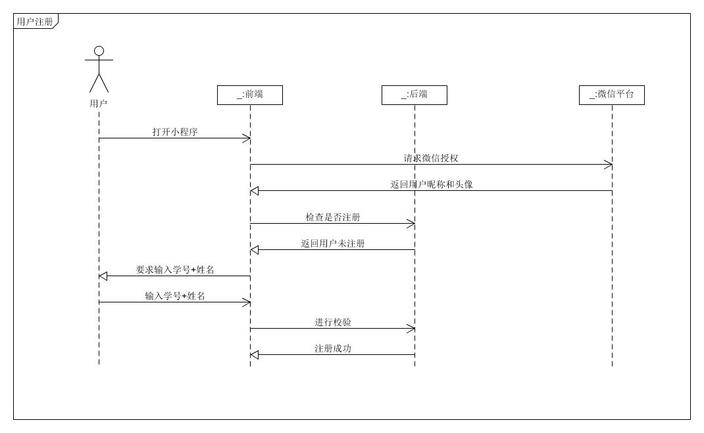
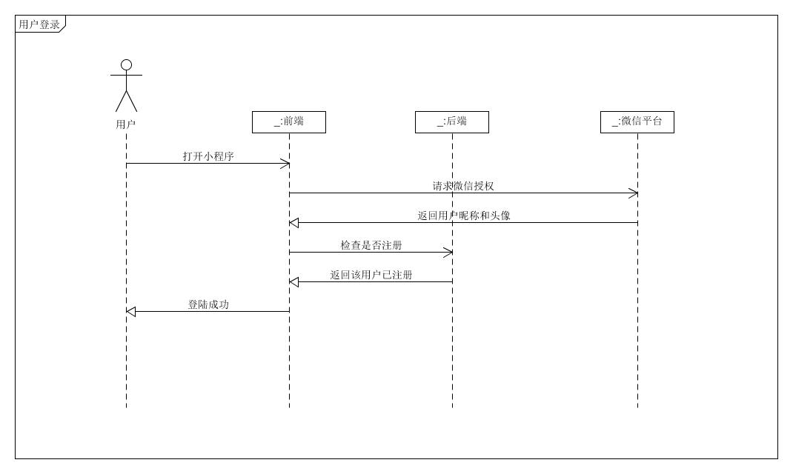
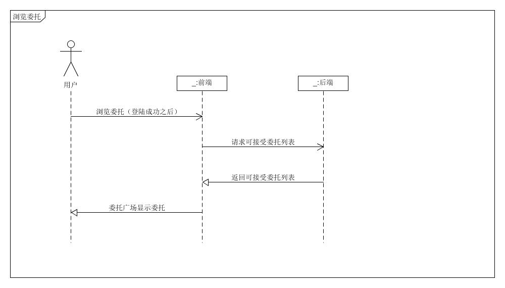
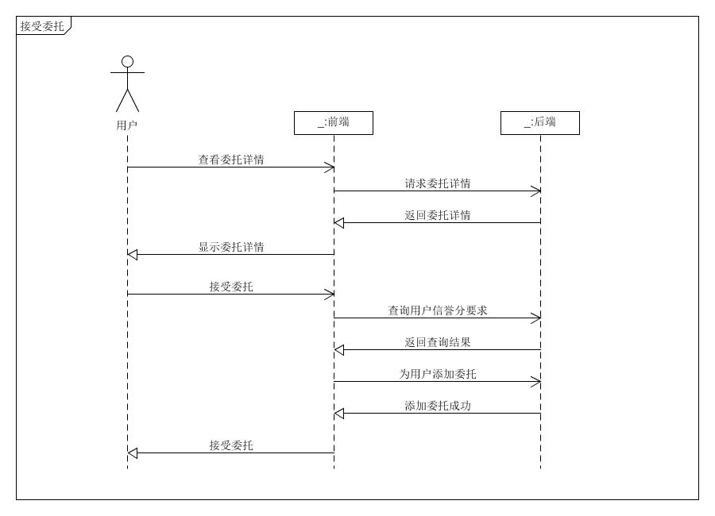
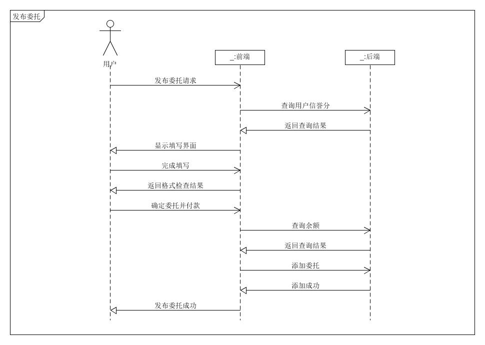
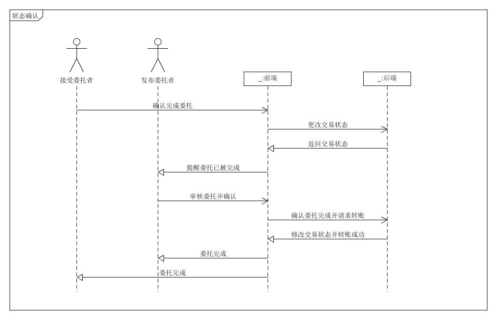
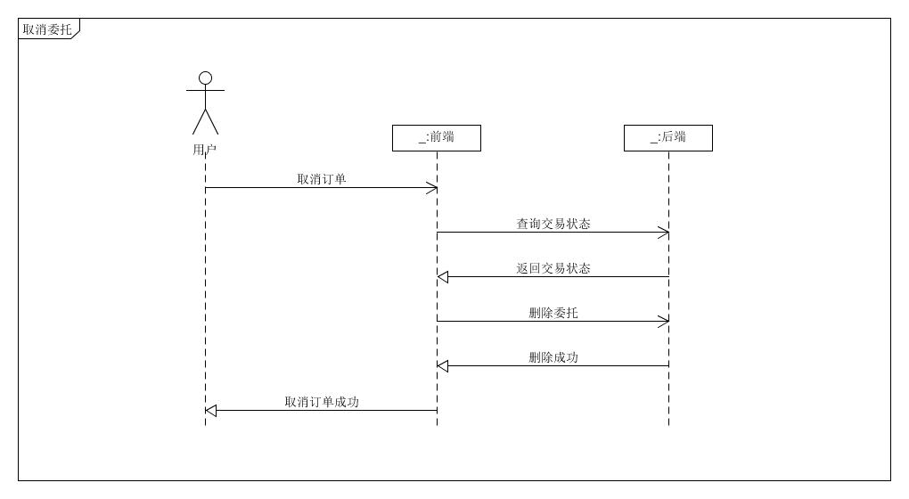

# System Sequence Diagram （功能模型）

根据我们的[用例分析](<https://github.com/sysu-team/sysu-team.github.io/blob/master/06-02-use-cases.md>)

## 基本功能

1. **用户注册**

   用户通过微信登录授权，直接使用个人微信账号的昵称和头像。微信授权之后需要进行校园用户认证，认证通过之后方可正常使用小程序

2. **用户登录**

   用户登录直接请求微信授权，并根据微信授权的相关信息，在后台数据库中获取个人用户信息

3. **浏览委托**

   用户浏览委托时，前端会定时向后端数据库请求委托数据，并对前端显示的委托信息进行实时更新

4. **接受委托**

   接受委托的用户，首先可以查看该委托的详情决定是否接受委托；当点击接受委托按钮时，前端会向后端请求该用户的信誉分情况，以确认用户是否有资格接受该委托；确认符合资格后，将为用户添加此委托，并建立新的交易

5. **发布委托**

   发布委托的用户发布委托时，首先前端向后端请求该用户的信誉分情况，确认该用户是否有资格发布委托；确认用户资格后，显示填写委托的界面；用户填写完毕后，前端对填写的内容进行格式审查，无误后由用户进行确认；确认完成后进入付款界面，用户付款后，前端向后端查询该用户余额等信息，确保支付成功；支付成功后，前端向后端请求添加委托，并提示用户发布委托成功

6. **交易确认**

   交易确认过程中，当接受委托的用户完成委托后，前端将提醒后端更改交易的状态，并提醒发布委托者交易状态的变更；发布委托者在一定的时间需要对完成的委托进行审核，并确认委托；发布委托者确认委托后，前端请求后端进行交易状态变更并进行系统转账；转账成功后，前端通知接受委托者和发布委托者该交易已经完成

7. **取消委托**

   用户有权对已发布的委托和已接受的委托进行取消。当用户进行取消委托操作时，前端向后端请求交易状态，并判断该交易状态下，操作的用户是否有权取消订单；若确认该用户有权进行该操作时，前端请求后端对交易状态进行变更，并删除该委托；同时提醒接受委托者和发布委托者该委托的变更信息

## 系统顺序图

**1.用户注册**

**2.用户登录**

**3.浏览委托**

**4.接受委托**

**5.发布委托**

**6.交易确认**

**7.取消委托**

