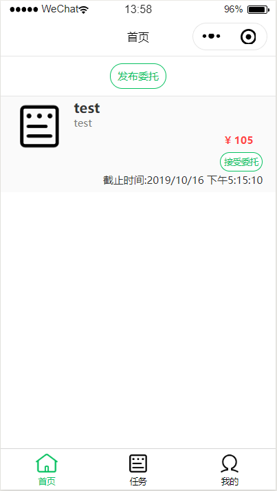

1. # UI Design

   ## 总览

   ### 1. 首页

   - 功能设想:首页展示所有的委托,同时有通道能够前往**发布委托**的页面
   - 设计: 
     - 使用card的形式, 展示委托
     - 同时顶部有按钮前往**发布委托**

   

   ### 2. 任务

   - 功能设想:展示所有用户发布,接受,完成的委托
   - 设计: 
     - 利用折叠板分类
     - 使用card的形式, 展示委托

   

   ### 3. 委托详情

   - 功能设想：显示委托信息，提供用户完成委托，取消委托，查看问卷，填写问卷的功能。
   - 设计：
     - 通过一系列单元格和折叠面板实现委托详情的展示
     - 添加四个按钮，对应委托之后的完成，取消等功能。
     - 

   ### 4.我的

   - 功能设想: 用户注册,登录,退出登录,查看信息和帮助
   - 设计: 
     - 通过简单的按钮实现注册,登录等, 登录后通过类似于card的形式展示部分信息
     - 使用单元格cell 实现查看信息和帮助的通道

   

   ### 5. 注册页

   - 功能设想: 为用户注册提供信息填写
   - 设计: 简单利用输入框实现

   

   ### 6. 发布委托页

   - 功能设想: 为用户发布委托提供委托信息填写
   - 设计: 简单利用输入框,步进器,选择器等实现

   

   ### 7. 生成问卷页

   - 功能设想: 为用户发布问卷委托时生成问卷
   - 设计: 
     - 简单利用checkbox实现问题选项
     - 各种状态转换,跳转页面内逻辑

   

   ### 8. 填写问卷页

   - 功能设想：用户可以填写问卷，但是基础版本只有单选题

   - 设计：

     - 使用单元格和radio group结合用于选择选项。

     

   ### 9. 问卷结果显示

   - 显示问卷填写的所有结果

   - 设计：

     - 多个单元格，循环展示

     

   ## 自评

   1. 逻辑较为清晰，界面不太拥挤
   2. 有些逻辑尚不完善,用户体验有所下降
