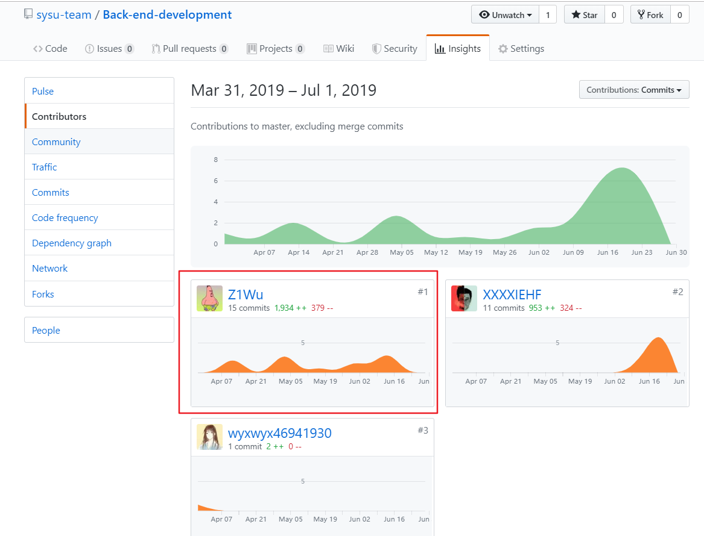

#项目个人报告

__吴梓溢__

## 简短的课程学习自我总结

在本次项目里面，我负责的部分是后端的编码部分的工作以及部分的设计工作。

### 设计阶段

经过这次项目之后，根据需求来设计代码结构是整个开发流程最为困难的部分，一方面要符合目前需求，另外一方面还有注意可拓展性，一开始没有想好就开始粗犷的编程，导致功能虽然能够实现，但是代码的耦合度和可拓展性很差，有很多冗余的代码，同时一个部分的修改，经常会影响到其他的部分，后面才进行重构，认真设计之后才分配工作进行开发，设计还是需要一下项目经历的支持，由于之前没有什么项目开发经历，所以设计起来挺困难的，后面随着实训的进行，积累了一些经验，把实训中的架构设计的引入到这次项目中来，借鉴一下比较正规的设计。

### 编码阶段

有了比较完善的设计方案之后，后续的编码过程就轻松多了，只有各种设计文档都规定好，再加上现在的后端框架功能比较成熟完善，写起代码来就比较舒服了。

本人参与度比较高的是项目的设计以及后端前期整体架构的搭建，后面只是在做一些测试和总结，不过后端队友还是很不错，在我的之前的架构上添加了一些新的功能，让项目的功能更加完整。总体来说，整个项目的队友都好的完成了自己的工作，在这里特别致谢一下。

## PSP 2.1

| PSP 2.1                                 | Personal Software Process Stages      | Time (%) Senior Student |
| --------------------------------------- | ------------------------------------- | ----------------------- |
| **Input Required**                            |                                   | ***5***                |
|                                 | 计划                                  | 5                     |
| **Planning** |               | ***20***                |
|                              | 分析需求，编写需求文档   | 10              |
|                               | 技术选型（确定技术栈） | 5                     |
| j | 制作进度模板（规定DDL） | 5                     |
| **Development** |          | ***60***              |
|                        | 设计程序                         | 20                 |
|                          | 审查设计                          | 5                     |
|                          | 实施编码                        | 20                  |
|  | 测试代码                  | 5                       |
|                            | 部署项目 | 10                     |
| **Exit Criteria** |                            | ***15***               |
|                             | 完成测试报告                        | 5                       |
|                       | 完成项目总结                 | 5                      |
|  | 完成设计和代码审查清单 | 5                       |

## 个人分支的 GIT 统计报告

## 自认为最得意/或有价值/或有苦劳的工作清单

### 最有价值

借鉴了实训的 `golang` 项目架构，设计了比较合理的项目编写方案，让后续的开发变得简单，拓展性比较强，耦合度比较低。

### 最有苦劳

在项目进行到一半的时候，不小心把项目的配置文件传到了 `github` 上，项目文件中包含了各种各样的私密信息，包括数据库的密码和小程序 `APP SECRETE`等，而且在误传了这个配置文件之后，没有立刻察觉到，添加了多个commit，导致情况比较复杂，本来是分离是开发的，每个人只对自己的部分比较熟悉，为了把这个误传 config 的 commit 从远程仓库中处理掉，同时有保留后续的 commit ，只能在本地进行 rebase 之后在强制重写远程仓库的历史，在 rebase 的过程中，会出些一些 confilct 情况，需要你熟悉代码，处理掉这些冲突，花费了较多时间，同时在 rebase 之后还需要进行测试，保证功能正常，花了比较多时间再补坑，算是比较有苦劳的吧.